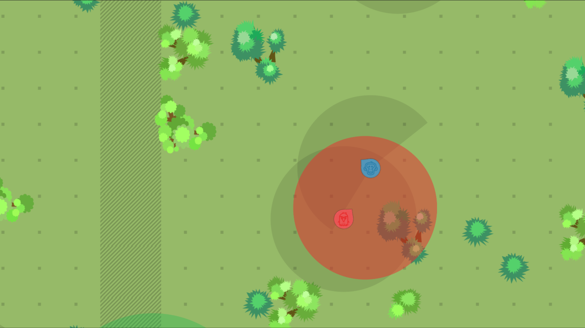

# Simps

  

[](https://www.youtube.com/watch?v=HeeFFVe0gBA)

[[Ver em Português](README.pt-br.md)]

**Simps** (pronouced `/sɪmps/`) is a semiotic process simulator writted in C# that uses [Unity](https://unity3d.com) as development engine. This project was part of _Multiagent Modeling and Simulation of Semiotic Processes: artificial semantics_ research line, developed by Study Group on Language, Cognition and Computation (LC2) of [Federal University of the Jequitinhonha and Mucuri Valleys](http://www.ufvjm.edu.br).

Simps is an artificial intelligence inspired on the ethologic case of _vervets_ monkeys purposed by [Loula et. al. (2004)](https://www.dca.fee.unicamp.br/~gudwin/ftp/publications/TeseLoula.pdf) in which prey and predators coexist in a virtual environment and interact with each other through basic processes such as associative memory, perception and focus of attention. Prey are provided with a set of words (lexicons) to report on events that have occurred, such as seeing a predator. The information is fired into the environment and can be perceived by other prey through their hearing sensors, which will react according to the interpretation obtained by their processing. In the end, a common lexicon is built from such interactions and, if well used, offers prey survival advantages. In this case, we say that the prey have learned to communicate through an _emerging language_.

For more project details, see the [paper](https://drive.google.com/file/d/1RpTITqPAhEirOiVWzSS7sNMw1LzWqGAu/view?usp=sharing) (only in Portuguese) of the authors.

## Getting started

The follow instructions show how you can get a copy of this project and run it on your local machine for development and tests purposes.

### Requirements

- [Unity 2020.1.15f1](https://unity.com/releases/editor/archive)
- Support IDE as [Visual Studio](https://www.visualstudio.com/pt-br/downloads/) or [MonoDevelop](http://www.monodevelop.com/download/)
  
> For Visual Studio, is necessary enable Unity support on installation items.

### Install

Clone the repository:

```
$ git clone https://github.com/davidsonbrsilva/simps.git
```

### Usage instructions

To run simulations on Simps:

1. Browse to `project/Assets/Scenes` folder and open the file `simulator.unity`. You can change the default simulation settings modifying the properties of `Core` object of `Hierarchy` tab through `Inspector`.
2. Click on `Play`.

## Authors

- Davidson Bruno da Silva <<davidsonbruno@outlook.com>>
- Leonardo Lana de Carvalho <<lanadecarvalholeonardo@gmail.com>>

Special thanks to [Tiago Ferreira Campos](https://github.com/caotic123) and [Lucas Vieira Souza](https://github.com/luksamuk) for accompanying the entire development process, contributing with tips and taking the time to help us personally.

## License

[MIT](LICENSE) Copyright (c) 2020, Davidson Bruno.
